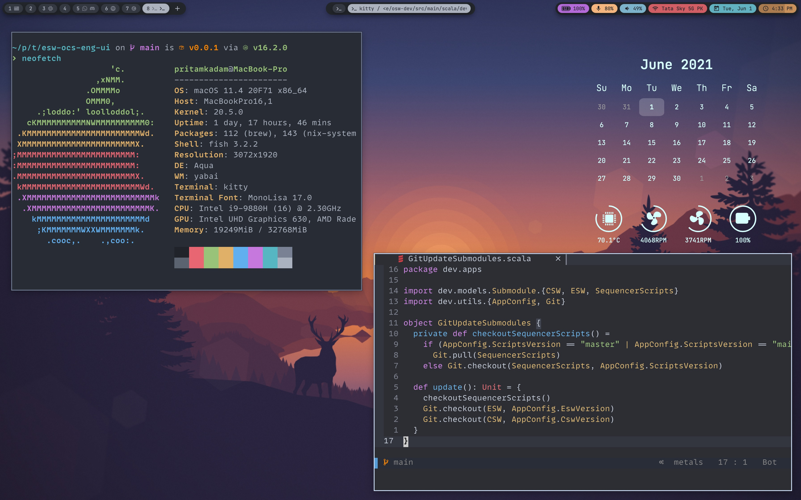

# My Nix Configs

This repo contains my Nix configs for MacOS.

## Highlights

- Package Manager: Nix + Homebrew via nix
- WM: Yabai
- Stacking windows: stackline
- Hotkey daemon: skhd
- Keyboard Customizer: Karabiner-Elements
- ubersicht
- simple bar
- Terminal: kitty
- neovim
- fish shell + starship
- File Manager: ranger
